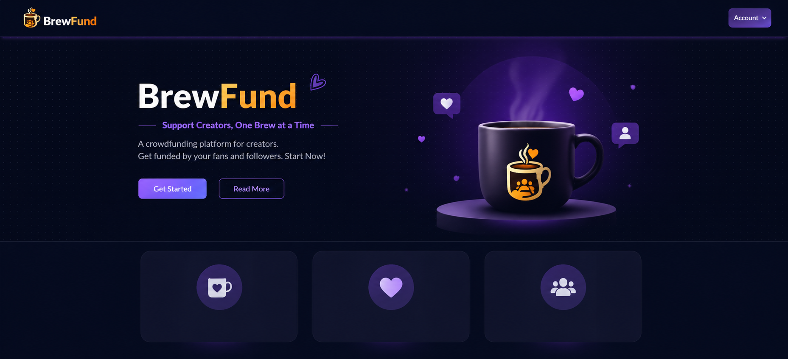

# ☕ Get Me A Chai

**Get Me A Chai** is a creator-support platform inspired by *Buy Me a Coffee*, *Patreon* where fans can support creators by buying them a chai ☕.  
Creators can set up profiles, receive payments, and connect with their supporters in a simple and friendly way.

Built with **Next.js**, modern UI practices, and a scalable architecture.

---

### 🖥️ App Interface


## ✨ Key Features

### 👤 Creator Experience
- Create and manage a public creator profile
- Upload profile picture & cover image
- Set bio and support message
- View supporters and contributions

### ☕ Supporter Experience
- Support creators with one-time payments
- Simple and fast checkout flow
- Optional message with each support

### 🧠 Platform Features
- Secure authentication
- Protected dashboard routes
- Responsive UI (mobile + desktop)
- Error handling & loading states
- SEO-friendly App Router structure

---

## 🛠️ Tech Stack

- **Framework:** Next.js (App Router)
- **Frontend:** React, Tailwind CSS
- **Backend:** Next.js API Routes
- **Database:** MongoDB
- **Authentication:** NextAuth (if applicable)
- **Payments:** Razorpay / Stripe

---

## 📂 Project Structure

get-me-a-chai/
├── app/ # App Router pages & layouts
├── components/ # Reusable UI components
├── lib/ # Utilities & helpers
├── models/ # MongoDB models
├── public/ # Static assets
├── styles/ # Global styles
├── .env.local # Environment variables
└── README.md

---

## 🧑‍💻 Getting Started

### 1️⃣ Clone the repository

Then, install dependencies:

```bash
npm install
# or
yarn install
# or
pnpm install
```

Run the development server:
```bash
npm run dev
# or
yarn dev
# or
pnpm dev
# or
bun dev
```

## Environment Variables

Create a .env.local file in the root and add:
```
AUTH_ID=app authentication id
AUTH_SECRET=secret

RAZORPAY_KEY_ID=rzr_test_xxxxxxxxxx
RAZORPAY_KEY_SECRET=secret
NEXT_PUBLIC_RAZORPAY_KEY_ID=rzr_test_xxxxxxxxxx

NEXT_PUBLIC_URL=http://localhost:3000
NEXTAUTH_URL=http://localhost:3000

MONGODB_URI=your_mongodb_connection_string
NEXTAUTH_SECRET=your_secret_key

PAYMENT_GATEWAY_KEY=your_key
```

# 🧑‍💻 Author

Built by [Rohan Jha]
💼 Full-Stack Developer
☕ Fueled by chai and clean code
